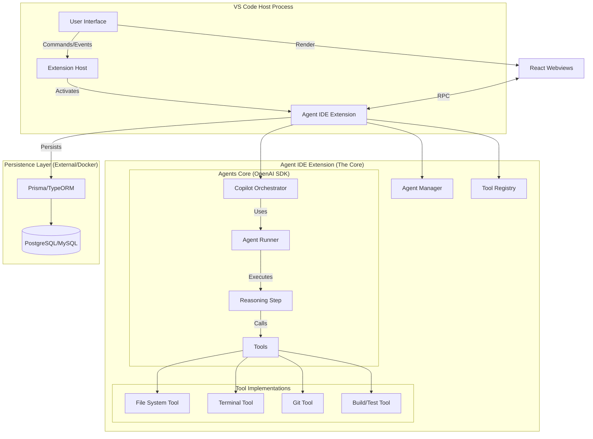

# VS CODE – AGENTS FIRST IDE: Architecture Overview

## 1. Product Vision
**"VS Code – Agents First IDE"** is a platform where the editor serves the agents, not just the human. It transforms VS Code from a passive text editor into an active, agent-driven development environment.

### Core Pillars
1.  **Agent Autonomy**: Agents can read, write, execute, and plan without constant human hand-holding.
2.  **Native Integration**: Agents are not just a sidebar chat; they control the file system, terminal, and git provider directly.
3.  **Robust Orchestration**: Multi-agent systems (Manager, Coder, Reviewer) work together using the OpenAI Agents SDK.
4.  **Persistence & Observability**: Every action, plan, and tool call is logged and persisted for replayability and debugging.

---

## 2. System Architecture Diagram

---

## 3. Component Flow

1.  **Initialization**:
    *   Extension activates.
    *   `AgentManager` connects to the Database.
    *   `ToolRegistry` registers all VS Code APIs as Agent Tools.
    *   `Copilot` agent is hydrated from the DB (or created).

2.  **User Interaction**:
    *   User types in `Copilot Panel` (Webview).
    *   Message is sent to `Agent IDE Core`.
    *   Core persists message to `messages` table.
    *   Core dispatches to `Copilot` agent via OpenAI Agents SDK.

3.  **Agent Execution (The Loop)**:
    *   **Plan**: Agent analyzes history and user request.
    *   **Reasoning**: Agent decides to call a tool (e.g., `list_files`).
    *   **Tool Execution**: `Runner` executes `list_files` mapped to `vscode.workspace.findFiles`.
    *   **Observation**: Result returned to Agent.
    *   **Action**: Agent decides to edit a file (`write_file`).
    *   **Feedback**: Agent confirms success to User.

4.  **Handoffs**:
    *   Copilot realizes the task is "Fix Database Schema".
    *   Copilot calls `handoff_to(agent="DB_Specialist")`.
    *   `DB_Specialist` takes over the session context.

---

## 4. Technology Stack

*   **Host**: VS Code Open Source (Code - OSS).
*   **Language**: TypeScript (Strict Mode).
*   **AI Engine**: OpenAI Agents SDK (Node.js).
*   **UI Framework**: React (inside Webviews) + VS Code Native UI (QuickPick, TreeViews).
*   **Database**: PostgreSQL (via Docker) or SQLite (for local dev mode initially).
*   **ORM**: Prisma (for type safety and schema management).
*   **Communication**: JSON-RPC between Webviews and Extension Host.
